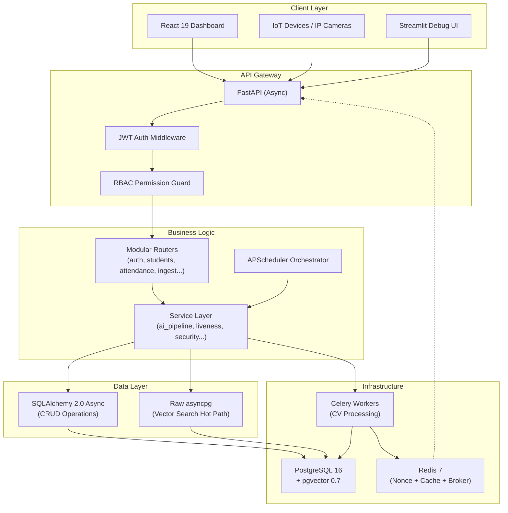
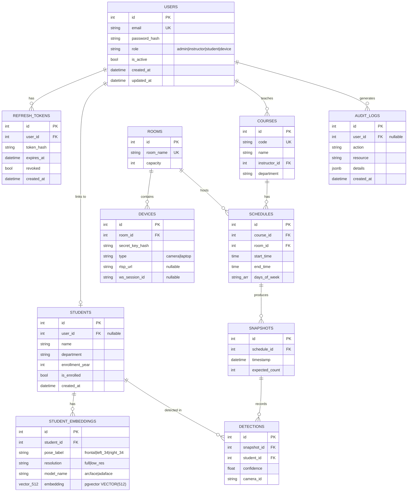
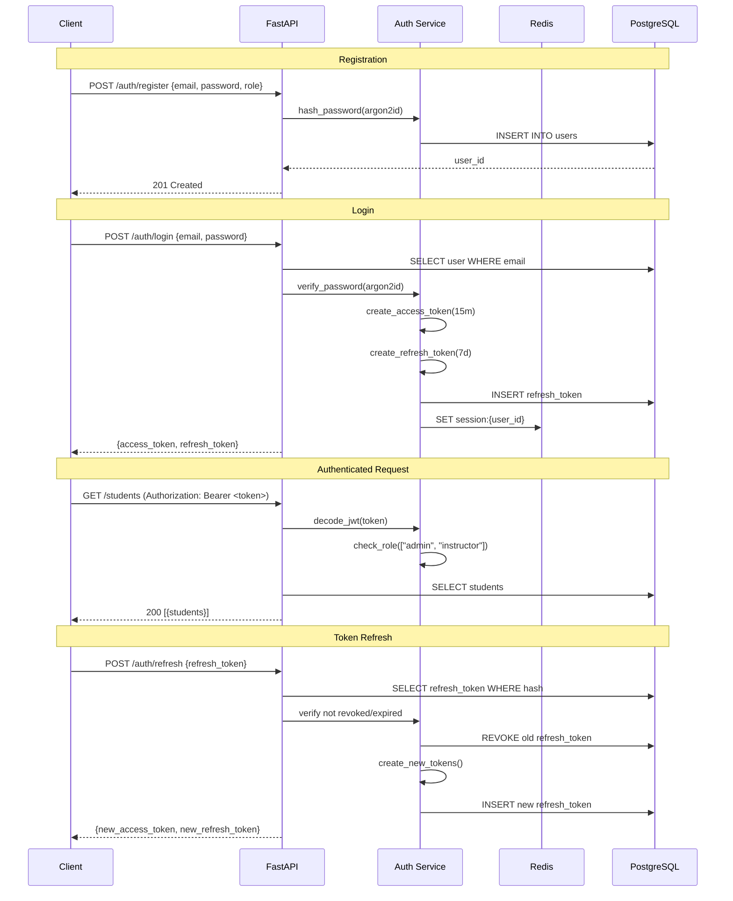

# ARCHITECTURE.md — Attendance System V2

> **Owner**: architect-coordinator (Judge persona)  
> **Date**: 2026-03-28  
> **Method**: Native Consensus Research Protocol  
> **Inputs**: `research_candidate_1.md` (SQLAlchemy Async + Redis) vs `research_candidate_2.md` (Tortoise ORM + Dragonfly)

---

## Judge Evaluation

### Scoring Matrix

| Criterion (Weight) | Candidate 1 (SQLAlchemy+Redis) | Candidate 2 (Tortoise+Dragonfly) | Winner |
|---------------------|------|------|--------|
| **Migration Risk** (25%) | 9/10 — evolutionary upgrade, V1 models reusable | 3/10 — full rewrite, zero V1 code reuse | **C1** |
| **Async Maturity** (15%) | 7/10 — greenlet shim works but isn't native | 9/10 — truly native async ORM | **C2** |
| **Ecosystem & Support** (20%) | 9/10 — massive community, Alembic, plugins | 5/10 — smaller community, fewer tutorials | **C1** |
| **Performance (Hot Path)** (15%) | 7/10 — ORM overhead on vector queries | 9/10 — raw asyncpg for vectors, ORM for CRUD | **C2** |
| **Operational Complexity** (10%) | 8/10 — Redis is proven, well-understood | 6/10 — Dragonfly is newer, less battle-tested | **C1** |
| **Boilerplate & DX** (10%) | 6/10 — verbose Mapped[] annotations | 8/10 — clean Active Record pattern | **C2** |
| **pgvector Integration** (5%) | 8/10 — pgvector-sqlalchemy adapter exists | 6/10 — must use raw SQL (no adapter) | **C1** |

### Weighted Score
- **Candidate 1**: (9×25 + 7×15 + 9×20 + 7×15 + 8×10 + 6×10 + 8×5) / 100 = **7.90**
- **Candidate 2**: (3×25 + 9×15 + 5×20 + 9×15 + 6×10 + 8×10 + 6×5) / 100 = **5.95**

### Verdict: **Candidate 1 WINS** — with surgical imports from Candidate 2

---

## Final Architecture Decision

### Core Stack

| Layer | Technology | Version | Rationale |
|-------|-----------|---------|-----------|
| **Language** | Python | 3.12+ | Latest async features, performance improvements |
| **Framework** | FastAPI | 0.115+ | Async, auto-OpenAPI, dependency injection |
| **ORM** | SQLAlchemy 2.0 | Async mode | Proven, V1 compatible, Alembic migrations |
| **DB Driver** | asyncpg | 0.30+ | Pure async PostgreSQL driver |
| **Database** | PostgreSQL 16 | + pgvector 0.7 | Relational + vector search in one engine |
| **Cache/Broker** | Redis 7 | Alpine | Nonce store, Celery broker, session cache, pub/sub |
| **Task Queue** | Celery 5.4 | + Redis broker | CV worker parallelism (V1 pattern, proven) |
| **Migrations** | Alembic | 1.14+ | Auto-generate from model diffs |
| **Auth** | PyJWT + Argon2 | — | JWT tokens + Argon2id password hashing |
| **Frontend** | React 19 + Vite | — | Dashboard (Streamlit kept for debug only) |
| **Container** | Docker Compose | v3.9 | Multi-service orchestration |

### **Imported from Candidate 2**: Raw asyncpg for vector search hot path

The single best idea from Candidate 2: bypass the ORM for embedding/vector queries. Use raw `asyncpg` for the face-matching hot path where ORM overhead matters.

```python
# HOT PATH: raw asyncpg (Candidate 2's approach, adopted)
async def find_nearest_faces(pool, query_embedding: list[float], k: int = 5):
    async with pool.acquire() as conn:
        return await conn.fetch("""
            SELECT s.id, s.name, 1 - (se.embedding <=> $1::vector) AS sim
            FROM student_embeddings se
            JOIN students s ON s.id = se.student_id
            WHERE s.is_enrolled = true
            ORDER BY se.embedding <=> $1::vector
            LIMIT $2
        """, str(query_embedding), k)

# CRUD: SQLAlchemy ORM (Candidate 1's approach)
async def get_student(db: AsyncSession, student_id: int) -> Student:
    result = await db.execute(select(Student).where(Student.id == student_id))
    return result.scalar_one_or_none()
```

---

## System Architecture Diagram



---

## Project Structure (V2)

```
Attendence-sys/
├── REQUIREMENTS.md
├── ARCHITECTURE.md
├── ROADMAP.md
├── .state/                          # Consensus research artifacts
│   ├── research_candidate_1.md
│   └── research_candidate_2.md
├── .env
├── .env.example
├── docker-compose.yml
├── Dockerfile
├── pyproject.toml                   # Python project config (replaces requirements.txt)
├── alembic.ini
├── alembic/
│   ├── env.py
│   └── versions/
│
├── backend/
│   ├── __init__.py
│   ├── main.py                      # FastAPI app factory + lifespan
│   │
│   ├── core/
│   │   ├── config.py                # Pydantic Settings
│   │   ├── security.py              # JWT encode/decode, Argon2 hashing
│   │   └── constants.py             # Roles enum, error codes
│   │
│   ├── db/
│   │   ├── session.py               # AsyncEngine + AsyncSession factory
│   │   ├── base.py                  # DeclarativeBase
│   │   └── vector.py                # Raw asyncpg vector query functions
│   │
│   ├── models/
│   │   ├── __init__.py              # Re-export all models
│   │   ├── user.py                  # Users, RefreshTokens
│   │   ├── student.py               # Students, StudentEmbeddings
│   │   ├── room.py                  # Rooms, Devices
│   │   ├── course.py                # Courses, Schedules
│   │   ├── attendance.py            # Snapshots, Detections
│   │   └── audit.py                 # AuditLogs
│   │
│   ├── schemas/
│   │   ├── auth.py                  # LoginRequest, TokenResponse, etc.
│   │   ├── user.py                  # UserCreate, UserRead, UserUpdate
│   │   ├── student.py               # StudentCreate, StudentRead, EnrollRequest
│   │   ├── course.py                # CourseCreate, CourseRead
│   │   ├── attendance.py            # AttendanceReport, DetectionEvent
│   │   └── common.py                # PaginatedResponse, ErrorResponse
│   │
│   ├── api/
│   │   ├── deps.py                  # get_db, get_current_user, require_role()
│   │   └── v1/
│   │       ├── __init__.py          # Aggregate v1 router
│   │       ├── auth.py
│   │       ├── users.py
│   │       ├── students.py
│   │       ├── courses.py
│   │       ├── schedules.py
│   │       ├── rooms.py
│   │       ├── devices.py
│   │       ├── ingest.py
│   │       ├── attendance.py
│   │       └── system.py
│   │
│   ├── services/
│   │   ├── auth_service.py          # Registration, login, token rotation
│   │   ├── user_service.py          # User CRUD
│   │   ├── student_service.py       # Enrollment logic
│   │   ├── attendance_service.py    # Attendance computation
│   │   ├── ai_pipeline.py           # SAHI + YOLO + ArcFace (from V1)
│   │   ├── liveness.py              # 3-tier liveness (from V1)
│   │   ├── preprocessing.py         # Image preprocessing (from V1)
│   │   ├── face_sr.py               # Super-resolution (from V1)
│   │   ├── security.py              # HMAC verification (from V1)
│   │   ├── redis_service.py         # Nonce, rate limiting, session cache
│   │   ├── orchestrator.py          # APScheduler triggers
│   │   ├── websocket_manager.py     # WS device control
│   │   ├── calibration.py           # Calibration logging
│   │   └── audit_service.py         # Audit log writer
│   │
│   ├── workers/
│   │   ├── celery_app.py            # Celery config
│   │   └── cv_tasks.py              # CV processing tasks
│   │
│   └── tests/
│       ├── conftest.py              # Async test fixtures
│       ├── test_auth.py
│       ├── test_rbac.py
│       ├── test_students.py
│       ├── test_attendance.py
│       ├── test_ai_pipeline.py      # Ported from V1
│       ├── test_liveness.py         # Ported from V1
│       ├── test_preprocessing.py    # Ported from V1
│       └── test_security.py         # Ported from V1
│
├── frontend/                        # React 19 + Vite
│   ├── package.json
│   ├── vite.config.ts
│   ├── src/
│   │   ├── main.tsx
│   │   ├── App.tsx
│   │   ├── api/                     # API client (fetch wrapper)
│   │   ├── hooks/                   # Custom React hooks
│   │   ├── pages/
│   │   │   ├── Login.tsx
│   │   │   ├── Dashboard.tsx
│   │   │   ├── Students.tsx
│   │   │   ├── Attendance.tsx
│   │   │   ├── Courses.tsx
│   │   │   └── Settings.tsx
│   │   ├── components/
│   │   │   ├── layout/
│   │   │   ├── auth/
│   │   │   └── attendance/
│   │   └── styles/
│   └── public/
│
├── streamlit_app/                   # Debug-only UI (from V1)
│   └── app.py
│
├── scripts/
│   ├── seed_data.py
│   ├── download_models.py
│   └── calibrate_threshold.py
│
└── models/                          # AI model weights (gitignored)
    ├── yolov8m-face.pt
    ├── adaface_ir101_webface12m.onnx
    └── realesrgan_x4.onnx
```

---

## Database Schema (V2)



---

## Authentication & Authorization Flow



---

## Redis Architecture

```
Redis 7 (Single Instance, Logical DB Separation)
├── DB 0 — Nonce Store
│   └── nonce:{device_id}:{nonce} → "1" (EX 60, SET NX)
├── DB 1 — Celery (Broker + Results)
│   └── (Managed by Celery internals)
├── DB 2 — Session Cache
│   └── session:{user_id} → {role, email, last_active} (EX 604800)
├── DB 3 — Rate Limiting + Pub/Sub
│   ├── rate:{device_id} → counter (EX 30)
│   └── CHANNEL attendance:{schedule_id} → SSE events
```

---

## Key Design Decisions

| # | Decision | Choice | Rationale |
|---|----------|--------|-----------|
| 1 | ORM | SQLAlchemy 2.0 Async | Lower migration risk, V1 models reusable, Alembic proven |
| 2 | Vector queries | Raw asyncpg (bypass ORM) | Zero overhead on hottest code path (from Candidate 2) |
| 3 | Cache | Redis 7 (not Dragonfly) | Battle-tested, sufficient throughput for V2 scale |
| 4 | Password hashing | Argon2id (replaces bcrypt) | OWASP recommends, memory-hard, better than bcrypt |
| 5 | Frontend | React 19 + Vite | Production dashboard, Streamlit kept for debug |
| 6 | API versioning | `/api/v1/` prefix | Future-proofing for backward-compatible API evolution |
| 7 | Router architecture | Per-domain modular files | Eliminates 42KB monolith from V1 |
| 8 | Project config | pyproject.toml | Modern Python packaging, replaces requirements.txt |
| 9 | Embedding storage | pgvector `VECTOR(512)` + HNSW | Native ANN search, replaces NumPy O(n) cosine scan |
| 10 | Audit trail | JSONB audit_logs table | Full attribution, queryable with GIN index |
