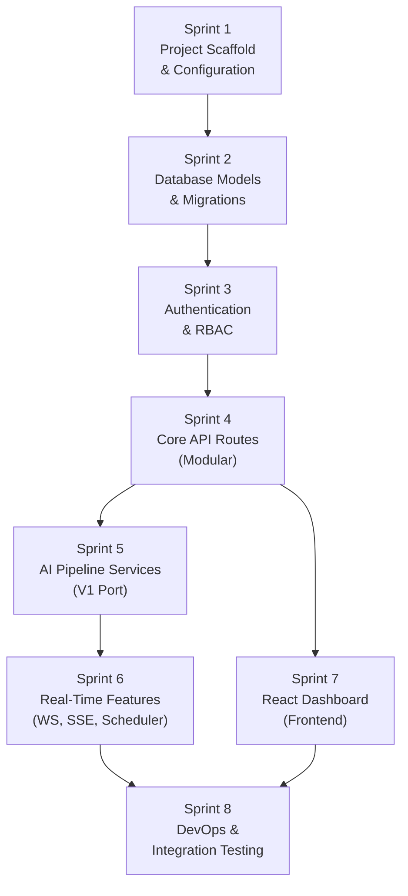

# ROADMAP.md — Attendance System V2

> **Owner**: architect-coordinator  
> **Date**: 2026-03-28  
> **Methodology**: SPARC (Specification → Pseudocode → Architecture → Refinement → Completion)

---

## Dependency Graph

---

## Sprint 1 — Project Scaffold & Configuration

**Agent**: architect-coordinator → devops-infra-engineer  
**Goal**: Clean project structure with modern Python tooling.

| Item | Status |
|------|--------|
| `pyproject.toml` with all dependencies | ⬜ |
| Pydantic Settings `config.py` (all V1 flags + new auth config) | ⬜ |
| `.env.example` with all environment variables | ⬜ |
| `constants.py` — Role enum, error codes | ⬜ |
| `Dockerfile` (multi-stage, Python 3.12) | ⬜ |
| `docker-compose.yml` (app, worker, postgres, redis) | ⬜ |
| Directory skeleton matching ARCHITECTURE.md structure | ⬜ |
| `.gitignore` | ⬜ |

---

## Sprint 2 — Database Models & Migrations

**Agent**: web-backend-engineer  
**Goal**: All SQLAlchemy 2.0 async models + Alembic setup + pgvector integration.

| Item | Status |
|------|--------|
| `db/base.py` — DeclarativeBase | ⬜ |
| `db/session.py` — AsyncEngine + AsyncSession factory | ⬜ |
| `db/vector.py` — Raw asyncpg vector query functions | ⬜ |
| `models/user.py` — Users, RefreshTokens | ⬜ |
| `models/student.py` — Students, StudentEmbeddings (Vector 512) | ⬜ |
| `models/room.py` — Rooms, Devices | ⬜ |
| `models/course.py` — Courses, Schedules | ⬜ |
| `models/attendance.py` — Snapshots, Detections | ⬜ |
| `models/audit.py` — AuditLogs | ⬜ |
| Alembic init + initial migration | ⬜ |
| Pydantic schemas (all domains) | ⬜ |

---

## Sprint 3 — Authentication & RBAC

**Agent**: security-specialist → web-api-architect  
**Goal**: Complete JWT auth system with role-based access control.

| Item | Status |
|------|--------|
| `core/security.py` — JWT encode/decode, Argon2id hashing | ⬜ |
| `services/auth_service.py` — register, login, refresh, revoke | ⬜ |
| `services/redis_service.py` — nonce store, session cache, rate limiter | ⬜ |
| `api/deps.py` — get_current_user, require_role dependencies | ⬜ |
| `api/v1/auth.py` — Auth routes | ⬜ |
| `api/v1/users.py` — Admin user management routes | ⬜ |
| Unit tests for auth flows | ⬜ |
| Unit tests for RBAC enforcement | ⬜ |

---

## Sprint 4 — Core API Routes (Modular)

**Agent**: web-backend-engineer → web-api-architect  
**Goal**: All CRUD endpoints, modular router architecture.

| Item | Status |
|------|--------|
| `api/v1/students.py` — Student CRUD + enrollment endpoints | ⬜ |
| `api/v1/courses.py` — Course CRUD | ⬜ |
| `api/v1/schedules.py` — Schedule CRUD | ⬜ |
| `api/v1/rooms.py` — Room CRUD | ⬜ |
| `api/v1/devices.py` — Device registration | ⬜ |
| `api/v1/ingest.py` — HMAC-authenticated ingest | ⬜ |
| `api/v1/attendance.py` — Attendance queries + reports | ⬜ |
| `api/v1/system.py` — Health, AI status, audit logs | ⬜ |
| `services/audit_service.py` — Audit log writer | ⬜ |
| Main app factory with router aggregation | ⬜ |

---

## Sprint 5 — AI Pipeline Services (V1 Port)

**Agent**: ai-ml-lead → ai-ml-optimizer  
**Goal**: Port all V1 CV services with pgvector integration.

| Item | Status |
|------|--------|
| `services/ai_pipeline.py` — SAHI + YOLO + ArcFace (from V1) | ⬜ |
| `services/liveness.py` — 3-tier liveness (from V1) | ⬜ |
| `services/preprocessing.py` — Image preprocessing (from V1) | ⬜ |
| `services/face_sr.py` — Super-resolution (from V1) | ⬜ |
| `services/security.py` — HMAC verification (from V1) | ⬜ |
| `services/student_service.py` — Enrollment with pgvector | ⬜ |
| `services/attendance_service.py` — Batch computation | ⬜ |
| `workers/celery_app.py` + `cv_tasks.py` (from V1) | ⬜ |
| Port V1 tests (ai_pipeline, liveness, preprocessing, security) | ⬜ |

---

## Sprint 6 — Real-Time Features

**Agent**: web-backend-engineer  
**Goal**: WebSocket device control, SSE attendance stream, scheduler.

| Item | Status |
|------|--------|
| `services/websocket_manager.py` — WS device control (from V1) | ⬜ |
| `services/orchestrator.py` — APScheduler (from V1) | ⬜ |
| SSE endpoint for live attendance stream | ⬜ |
| Redis pub/sub for detection event broadcasting | ⬜ |

---

## Sprint 7 — React Dashboard (Frontend)

**Agent**: web-ui-ux-designer  
**Goal**: Production-grade React 19 + Vite dashboard.

| Item | Status |
|------|--------|
| Vite + React 19 + TypeScript scaffold | ⬜ |
| Auth pages (Login, Register) | ⬜ |
| Admin Dashboard (stats, user management, audit log) | ⬜ |
| Instructor View (courses, enrollment, live attendance) | ⬜ |
| Student View (personal attendance, profile) | ⬜ |
| Dark mode + responsive design | ⬜ |
| API client layer | ⬜ |

---

## Sprint 8 — DevOps & Integration Testing

**Agent**: devops-infra-engineer → qa-auditor  
**Goal**: CI/CD, integration tests, deployment readiness.

| Item | Status |
|------|--------|
| Docker Compose end-to-end test | ⬜ |
| GitHub Actions CI pipeline | ⬜ |
| Integration tests (auth → CRUD → attendance flow) | ⬜ |
| Seed data script | ⬜ |
| Model download script | ⬜ |
| API documentation (auto-generated from FastAPI) | ⬜ |
